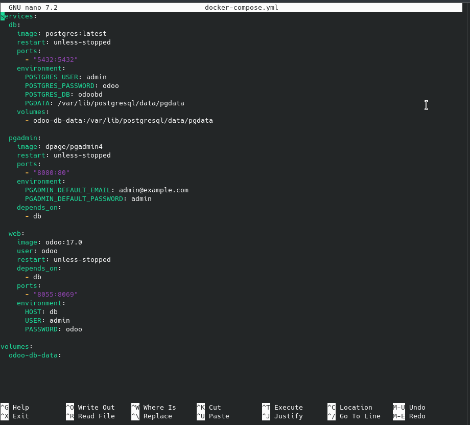
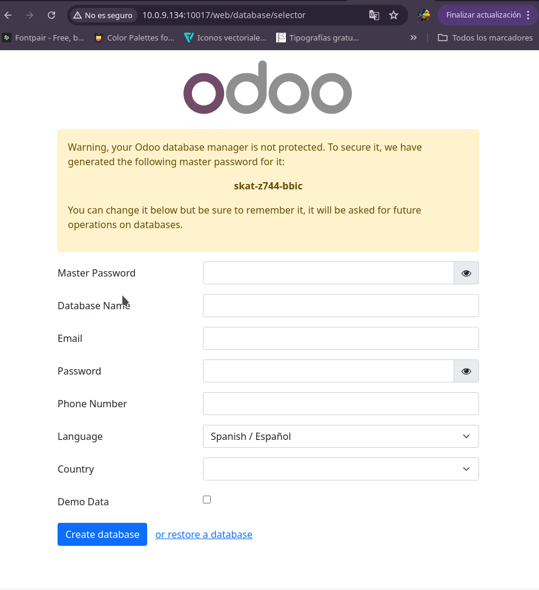
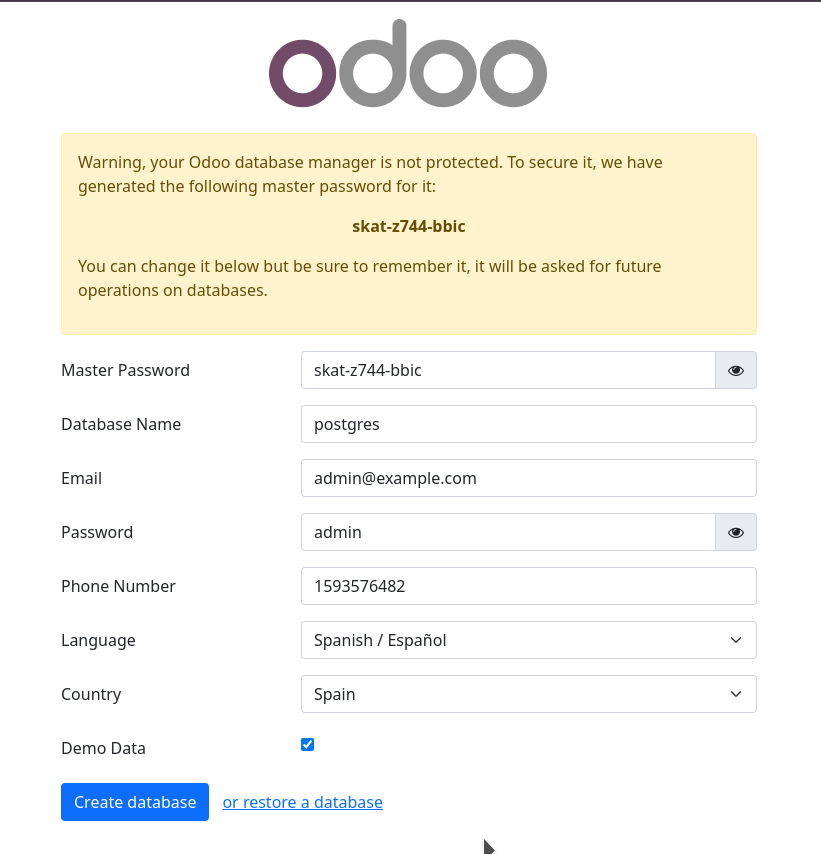
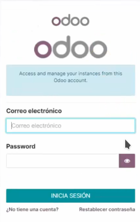
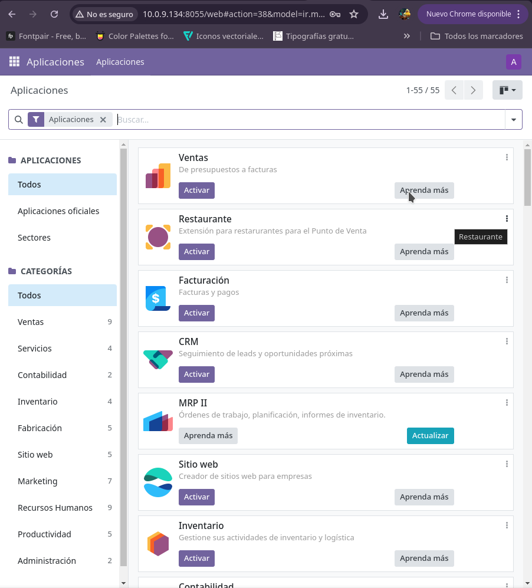
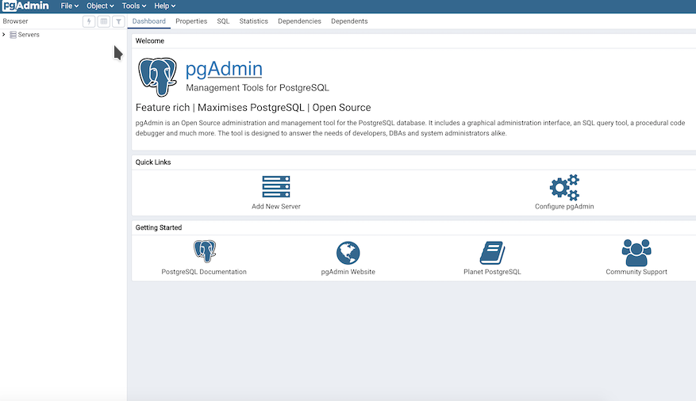
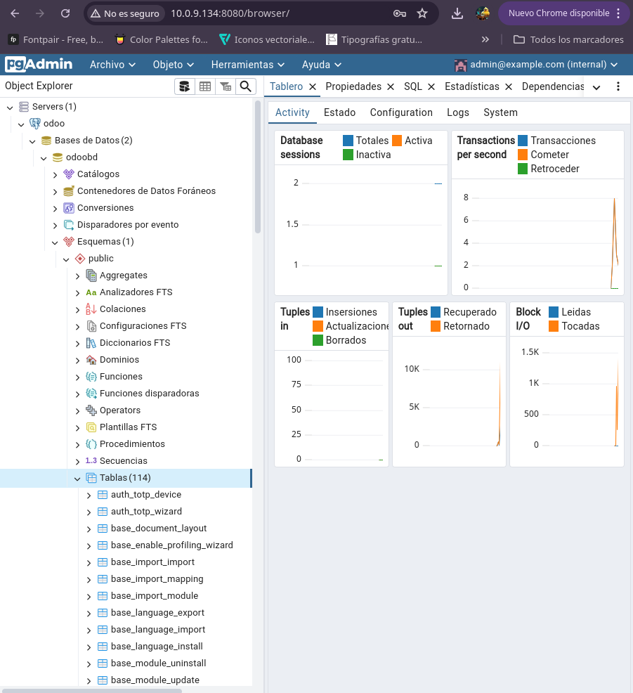

# Instalación de Odoo mediante docker compose

## Creamos el docker compose
Vamos a crear el documento yml, para ello vamos a abrir el editor de texto o con el comando:

```nano docker-compose.yml```

En el directorio que queremos que este el archivo. Dentro escribimos los servicios que necesitamos para la instaclación de Odoo.

- Base de datos: Postgresql
- Administrador de base de datos: pgAdmin
- Odoo

Vamos a escribir en el documento para descargar la imagen de postgres en su ultima version, el pgAdmin4 y en el odoo la versión 17.0. 

> [!IMPORTANT]
> Como vemos en el docker compose, tenemos que especificar la version de las imagenes que querramos
> descargar. Esto es importante ya que Odoo tiene diferentes módulos segun sus versiones.

En la base de datos ocupamos el puerto 5432, para conectarlo luego el pgAdmin4. A este le damos el puerto 80 y a Odoo utilizaremos el 8055, cabe destacar que odoo trabaja con el puerto 8069, por ello lo especificamos en el documento. 

Luego completamos el environment con los atributos en el caso de la base de datos, especificamos el user(usuario), la password(contraseña) y el nombre de la base de datos. En el pgAdmin vamos a especificar el correo y la contraseña que usaremos. Con Odoo vamos a especificar el host usaremos para concetar que seria el de la base de datos(bd), usuario y la contraseña.

Una vez terminado el documento lo guardamos y en el mismo directorio vamos a crear el contenedor que queremos con el comando:

``docker-compose up -d``

Asi se va a descargar los servidores con sus imagenes dentro del contenedor y podremos tener la conexión con Odoo y la base de datos.



## Comprobamos la conexión con Odoo
Accedemos desde el navegador con el IP+8055 a la base de datos de Odoo y completamos los campos que nos piden.



- Vamos llenar los datos los que escribimos en el documento de docker compose que creamos.
- Luego damos click en el check box porque vamos a utilizar la Demo data.
- Una vez todo listo y espeficiado creamos la database de odoo.

<details>
  <summary>Cuadro rellenado</summary>
  <br>

  

</details>

Cuando ya se haya creado la database nos pedira acceder con el correo y la contraseña que asignamos.



Al iniciar sesióin podremos visualizar todas las aplicaciones que nos ofrece Odoo.



## Conectamos con pgAdmin con Odoo
Para acceder a la base de datos postgresql lo vamos hacer atravez de pgAdmin, para ello en el navegador ponemos el IP+8080. Nos pedirá introducir nuestro correo y la contraseña con la que podemos acceder a la base de datos. Estos datos ya lo especificamos en el docker compose. Una vez rellenado todo accedemos a la base.
> *OJO --> La siguiente captura es solo referencial, me olvidé capturar antes.*



Para conectarlo con la base de datos de Odoo vamos a dar click en añadir nuevo servidor(add new server) ahi nos saldrá un cuadro donde podremos llenar los datos con la base que queremos conectar. En "General" con el nombre de **odoo** que es el nombre que dimos al servidor de postgresql, Luego llenamos con los siguientes datos en el apartado de "Conexión":
- Host: db
- Puerto: 5432
- Base de datos: postgres
- usuario: admin

Luego de llenar todo y aceptar se conectará con la base de datos de Odoo. Podremos visualizar en el apartado de al lado los servers que hayamos conectado, en este caso seria **odoo** y al desplegarlo podremos ver la base de datos de esto junto con sus tablas.




## Preguntas:

**¿Que ocurre si en el ordenador local el puerto 5432 está ocupado?**
Si el puerto esta ocupado, ocurriria un error al momento de querer  inicializar el pgAdmin, oir ende no se podrá conectar a la base de datos ni a Odoo.

**¿Y si lo estuviese el 8069?**
Al ser de Odoo este puerto, tampoco podria inicializarse ya que apareceria error al tratar de cargar la página.

**¿Cómo puedes solucionarlo?**
Una forma de solucionarlo es mapeando el puerto, es decir cambiar el puerto que dimos en el documento docker-compose, deteniendo antes con un ```docker-compose down```  el contenedor y una vez modificado volviendo a lanzarlo.
